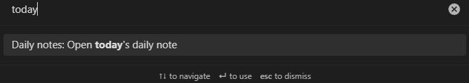
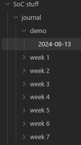
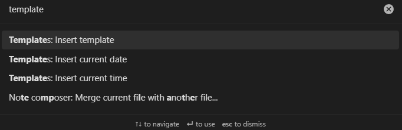
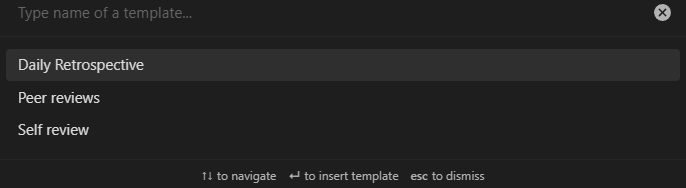
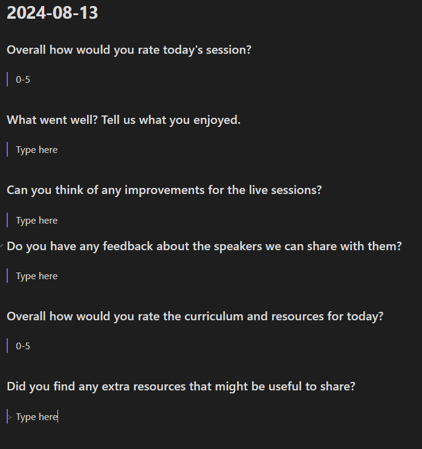

## Daily note template

Open the Command Palette (Ctrl-P on Windows, Cmd-P on Mac) and search for "today" to create a daily note for the day.

Drag the new note into a folder for the week (I am using 'demo' because this this is a demo 🙃)

Open the Command Palette again and search for "template" then select the command to "Insert template"

Then select the "Daily Retrospective" template

Now the template will appear as below, so you can update it through the day.

## Peer reviews and Self review

There are also templates for the weekly peer reviews and self reviews. Add them to notes for each week and you can work on them throughout the week.